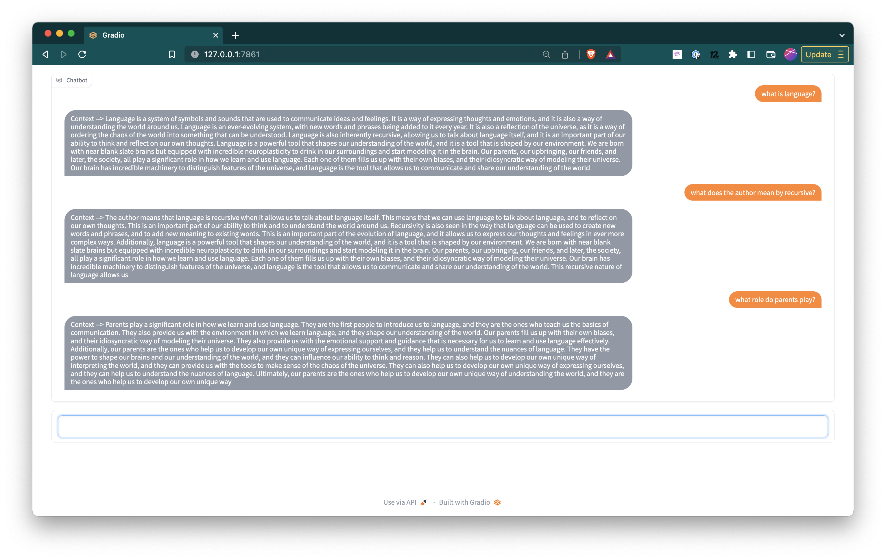

# Conversational AI

## Aim
To build a conversational AI that is able to parse through large volumes of text data and parse through it via a natural language conversation.

## Work in progress:
1. A CLI interface

2. A gradio interface

3. Chaining context

## Goals
- [x] Get a simple form of the AI to work off of a text file
- [x] Build the text file up via BeautifulSoup parser on your personal blog at https://anudeep.posthaven.com
- [x] Build, save and laod llm indexes
- [x] Get a simple conv-AI to work off of all the blog posts on your personal blog
- [x] Build a gradio/streamlit/pynecone UI
- [x] Enable actual conversation, that is chaining llm model outputs
- [x] Enable markdown support (default Markdown support in gradio is lousy)
- [ ] Create an index over all your conversations
- [ ] Show source of the answer
- [ ] Clear the textbox after a submission
- [ ] Enable the end of a conversation to reset the context
- [ ] Allow user to peek into the context being passed
- [ ] Build user pluggable module (show referrrals, suggestions)
