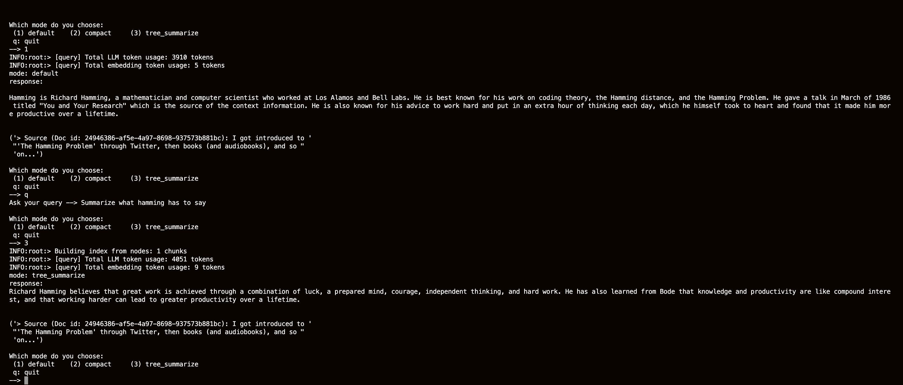
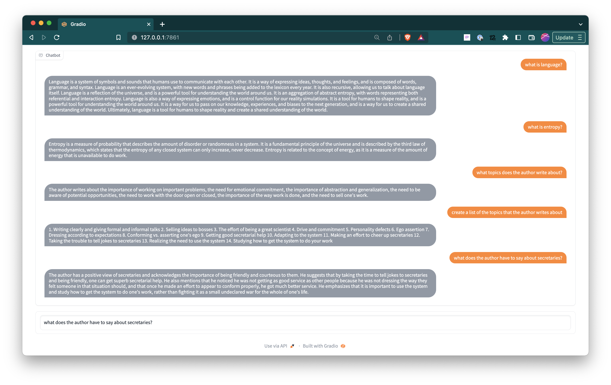

# Conversational AI 

## Aim
To build a conversational AI that is able to parse through large volumes of text data and parse through it via a natural language conversation. 

## Work in progress: 
1. A CLI interface

2. A gradio interface

## Goals
- [x] Get a simple form of the AI to work off of a text file 
- [x] Build the text file up via BeautifulSoup parser on your personal blog at https://anudeep.posthaven.com
- [x] Build, save and laod llm indexes
- [x] Get a simple conv-AI to work off of all the blog posts on your personal blog
- [x] Build a gradio/streamlit/pynecone UI
- [ ] Enable actual conversation, that is chaining llm model outputs
